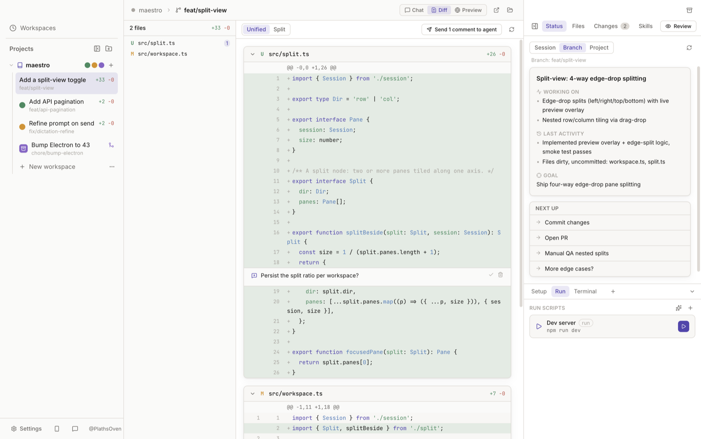

# Maestro

**Run coding agents in parallel.** Claude Code, Codex, Cursor, OpenCode, Kimi Code, and Grok Build,
side by side — each in its own git worktree, on its own branch, with its own chat, terminal, and diff.
A desktop app for macOS, Windows, and Linux, and an open clone of [Conductor](https://conductor.build).


## Why

I kept running four agents in four terminal tabs and losing track of who was stuck, who was waiting on
me, and which two were about to edit the same checkout. Maestro gives each one its own worktree so they
never collide, and one window to hand out work and review what comes back.

## How it works

**1. Hand out tasks.** Describe a task and go. Each workspace is a fresh `git worktree` on its own
branch, cut from the latest remote — so agents start clean and never step on each other.

**2. Glance, don't babysit.** The rail shows who's working, who's waiting on you, and what's done, with
a desktop notification when a background agent finishes. Run a second agent in the same workspace to
review the first, or delegate scoped work to sub-agents.

**3. Review and ship.** Read the diff, leave inline comments, ask for changes in the same chat, then
push and open the PR without leaving the app.



## Features

**Workspaces**
- Real `git worktree`s — one branch each, enforced by git; a name clash offers a `-2` suffix.
- Also works on a plain folder (a single in-place workspace, no branches) or a repo on a **remote
  machine over SSH** — every exec, pty, and file op then runs on that server.

**Agents, your keys**
- Claude Code, Codex, Cursor, OpenCode, Kimi Code, Grok Build, or a plain shell when you have no CLI.
- Auth passes straight through to each CLI's own login; Maestro never stores model API keys.
- Pick model and reasoning effort per chat. Claude Code is the most exercised harness.

**One window to read, run, and review**
- **Diff** (`⌘⇧D`) — worktree against the merge-base, file tree, split/unified, and comment threads
  that persist and can be sent back to the agent.
- **Terminal** — a real login shell (node-pty + xterm) in the worktree.
- **Editor** (`⌘⇧E`) — Monaco with `⌘S` to save, notebooks included.
- **Preview** (`⌘⇧B`) — an embedded browser on your dev server that both you and the agent can drive:
  it navigates, screenshots, and reads the console; you annotate and send the page back.
- **Checks** (`⌘⇧K`) — git ahead/behind, PR state and CI from `gh`, comments, deployments, and todos.
  Merge is gated on approval + green checks + resolved comments + done todos, with an override.
- **PR flow** (`⌘⇧P`) — push, draft the title and body from the real diff, `gh pr create`, poll checks,
  merge, archive.

**Around the app**
- Command palette (`⌘K`), `⌘1`–`9` to switch workspaces, light / dark / system themes.
- **Sign in with GitHub** in-app — a device flow that hands the token to `gh` (never stored by Maestro)
  and installs the GitHub CLI for you if it's missing.
- Dictation on macOS, one-click [Conductor](https://conductor.build) import, and background auto-update.
- `maestro-ask` lets an agent pause and ask you a multiple-choice question, answered inline in the chat.

## Repo settings — `.maestro/settings.toml`

Checked into the repo so the whole team shares them (or edit under Settings → Repository):

```toml
[scripts]
setup = "npm install && cp ~/secrets/.env .env"   # runs on workspace creation
run   = "npm run dev -- --port $WORKSPACE_PORT"    # each workspace gets its own port

[project]
instructions = "Durable guidance included in every agent session for this repo."
```

Scripts, terminals, and agents get `WORKSPACE_PORT`, `MAESTRO_WORKSPACE_NAME`, `MAESTRO_ROOT_PATH`,
and `MAESTRO_BRANCH` in their environment.

## Development

```bash
npm install       # also rebuilds better-sqlite3 + node-pty for Electron
npm run dev       # vite dev server + electron with HMR
npm start         # launch a production build
npm run dist:dmg  # macOS .dmg   (dist:win / dist:linux for the others)
```

Needs `git`. GitHub features use the GitHub CLI (preinstalled or auto-downloaded by the sign-in flow),
and each agent needs its own CLI (`claude`, `codex`, `cursor-agent`, `opencode`, `kimi`, or `grok`) —
the shell fallback needs none.

> **Windows:** native modules can't be cross-compiled from macOS, so the installer is built on a
> `windows-latest` runner by the `build-desktop` GitHub Actions workflow (trigger it, or push a `v*` tag).

### Tests

An end-to-end suite drives real repos, worktrees, and ptys (add `--with-claude` for a live model call):

```bash
npx esbuild scripts/e2e.ts --bundle --platform=node --format=cjs \
  --external:electron --external:better-sqlite3 --external:node-pty --outfile=dist/e2e.cjs
ELECTRON_RUN_AS_NODE=1 npx electron dist/e2e.cjs
```

Companion scripts under `scripts/` cover process launching (`launch-probe.ts` — worth running on
Windows after touching `src/main/launch.ts`), the GitHub PR pipeline against a throwaway repo
(`gh-e2e.ts`), and a headless UI smoke that screenshots the running app:

```bash
npm run build && npx electron . --smoke --screenshot=/tmp/maestro.png
```

## Architecture

```
┌────────────────────── Renderer (React 19 + Zustand) ──────────────────────┐
│ Sidebar · Chat · Terminal · Diff · Editor · Preview · Checks               │
└───────────────▲───────────────────────────────────────────────────────────┘
                │ typed IPC (contextBridge, src/shared/types.ts)
┌───────────────┴──────────────────── Main (Node) ──────────────────────────┐
│ git (worktrees/diff)   pty pool   harness adapters   github (gh CLI)       │
│ host layer (local · ssh2)   script runner   better-sqlite3   fs watchers   │
└───────────────────────────────────────────────────────────────────────────┘
```

Every exec / spawn / pty / fs call goes through a **host** — `LocalHost` or an `SshHost` — so the same
services run locally or over SSH. Workspaces live in `~/maestro/workspaces/<project>/<name>`; the DB is
`maestro.db` under the platform's app-data dir (`MAESTRO_DB_PATH` overrides it). Agent turns are stored
as structured blocks, so history renders identically after a restore.

## Notes

- Isolation is development-grade, not a security boundary — agents run with your local permissions
  (or the SSH user's, for remote projects).
- Dictation is macOS-only; the mic button is hidden elsewhere.
- Packaged builds send two anonymous counts (an install id — no account, prompts, paths, or PII) to
  gauge usage. It's off in dev and off unless a PostHog key is set at build time, so forks emit nothing.

## License

Copyright © 2026 Maestro contributors. Licensed under the
[Business Source License 1.1](LICENSE): read, run, self-host, modify, and redistribute freely — you
just can't offer Maestro to third parties as a competing hosted or embedded service. Four years after
each version ships, it converts to Apache 2.0.
